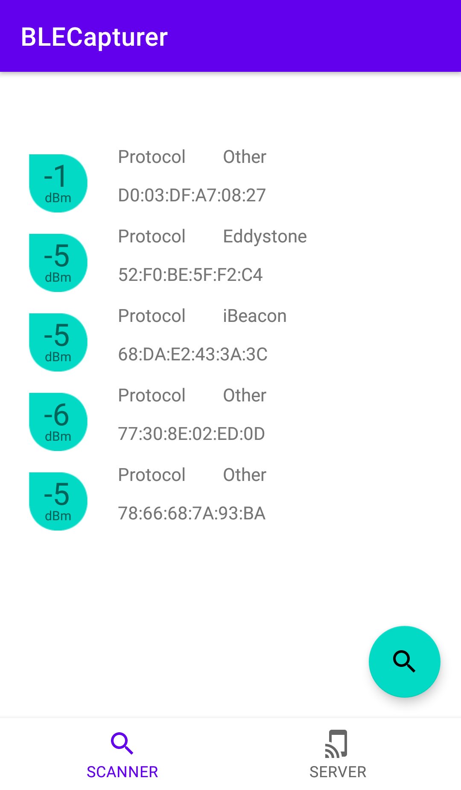
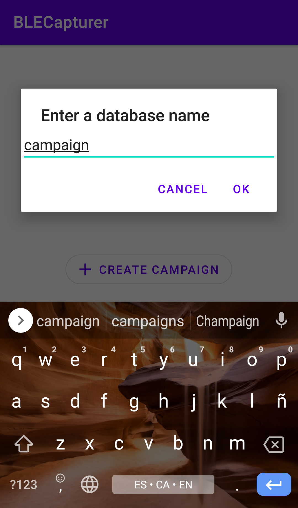
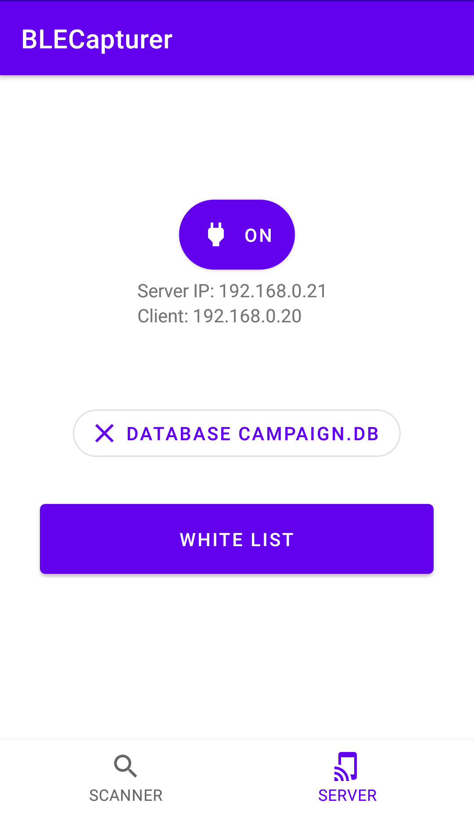
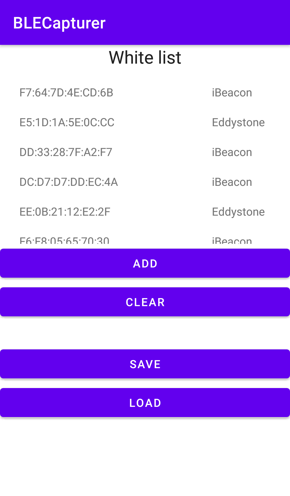
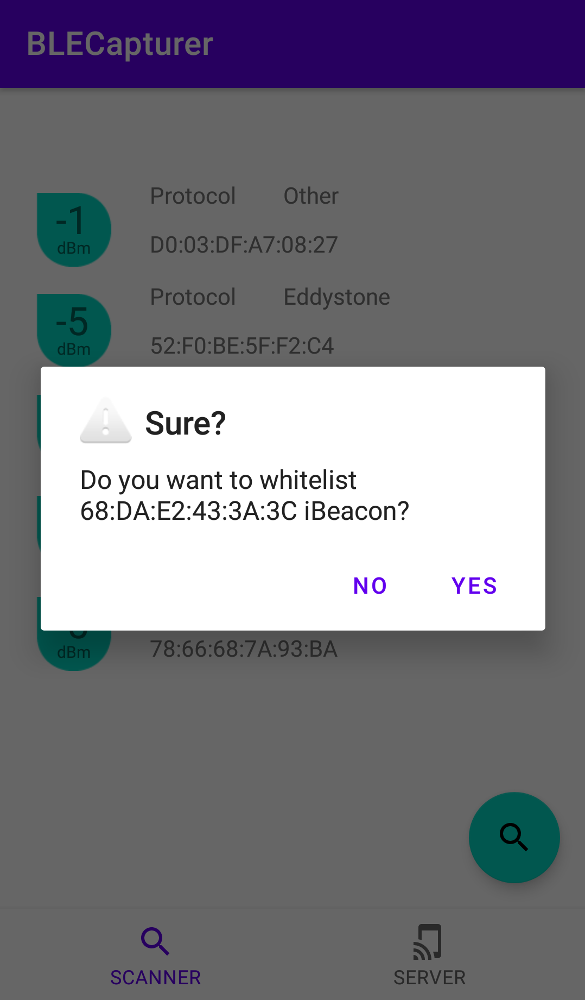
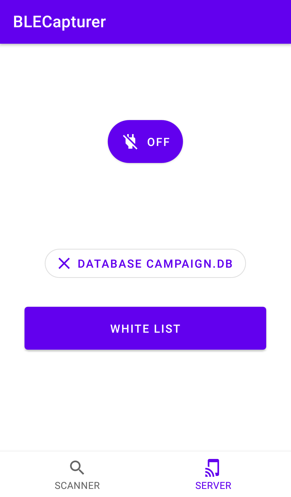

<!-- PROJECT LOGO -->
 

    
  </a>

  <h3 align="center">BLECS</h3>

  

    Bluetooth Low Energy Capture Server is an Android app to capture BLE packets from Android.
     
    <!--a href="https://github.com/othneildrew/Best-README-Template"><strong>Explore the docs »</strong></a-->
     
     
    <a href="https://www.youtube.com/">View Demo</a>
    ·
    <a href="https://github.com/bertoramos/ble_android_capture_server/issues">Report Bug</a>
    ·
    <a href="https://github.com/bertoramos/ble_android_capture_server/issues">Request Feature</a>
  

<!-- TABLE OF CONTENTS -->

  
Table of Contents

  <ol>
    <li>
      <a href="#about-the-project">About The Project</a>
      <ul>
        <li><a href="#built-with">Built With</a></li>
      </ul>
    </li>
    <li>
      <a href="#getting-started">Getting Started</a>
      <ul>
        <li><a href="#prerequisites">Prerequisites</a></li>
        <li><a href="#installation">Installation</a></li>
      </ul>
    </li>
    <li><a href="#usage">Usage</a></li>
    <li><a href="#contact">Contact</a></li>
  </ol>

 

---------------

<!-- ABOUT THE PROJECT -->
## About The Project

Ble capture server is an Android application implemented for capturing BLE packets. BLECS allows to generate a database for the study of indoor positioning systems using Bluetooth Low Energy.

(<a href="#top">back to top</a>)

### Built With

This project was built with android studio and programmed in Kotlin. This app was tested in an [Android Oreo 8.1](https://www.android.com/versions/oreo-8-0/) device.

Additional frameworks:

* [Material.io](https://material.io/)
* [MessagePack for Java](https://github.com/msgpack/msgpack-java)
* [MaskedEditText](https://github.com/egslava/edittext-mask)

(<a href="#top">back to top</a>)

<!-- GETTING STARTED -->
## Getting Started

### Prerequisites

For full access to all BLECS functionalities, [the client developed in Blender](https://github.com/bertoramos/drone_assistant) is required.

Alternatively, you can develop a client following the specifications explained in the paper. [Link not yet available](https://www.lipsum.com).

### Installation

This project is currently under development, so an APK is not yet available. You can clone this project and open in [Android Studio](https://developer.android.com/studio).

(<a href="#top">back to top</a>)

<!-- USAGE EXAMPLES -->
## Usage

### Bluetooth Low Energy Scanner

Reachable ble devices can be discovered by means of the ble scanner functionality. This function scans and lists all BLE signals received from each device, distinguishing by MAC and/or protocol.

The scanner is switched on by clicking on the magnifying glass button in *Scanner* tab.

### Database creation

Database result of server scanning are saved in a SQLite database. User can select database file name using *Create campaign* button in *Server* tab. Database file is saved in app internal storage directory (/Android/com.ips.blecapturer/files/)

 

### White listing

Whitelisting is a strategy under which app filters BLE devices saved in database.

There are two ways to add a device to the white list: by clicking on the devices found by the BLE scanner, or by adding them manually in the whitelist option in the *Server* tab. If white list is empty all beacon are allowed.

<table align="center">
  <tr>
    <th></th>
    <th></th>
  </tr>
  <tr>
    <td>Press <i>White list</i> button to open <i>white list panel.</i> </td>
    <td>BLE allowed devices are listed here. You can add, remove or clear list. Also you can save and load white list from a file.</td>
  </tr>
</table>

 
You can also add discovered BLE devices to white list.

### Server

The server allows commands to be sent remotely to the Android device to capture BLE signals for a given time. These signals are stored in the database and are related to a pose sent by the client.

To start the server, press the *on/off* toggle button on *Server* tab.

Please, refer to [client repository](https://github.com/bertoramos/drone_assistant) for more information about how this application can be used together with Blender client.

<!-- CONTACT -->
## Contact

Alberto Ramos Sánchez - [alberto.ramos104@alu.ulpgc.es](mailto:alberto.ramos104@alu.ulpgc.es)

(<a href="#top">back to top</a>)

